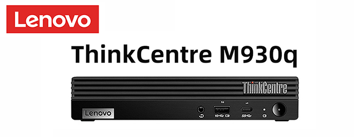
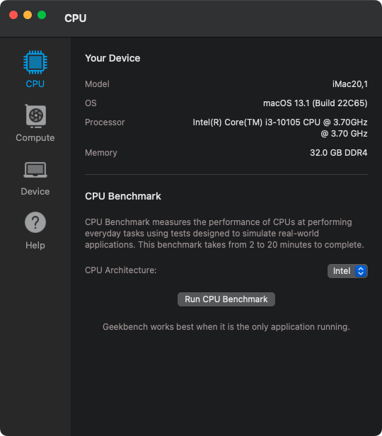
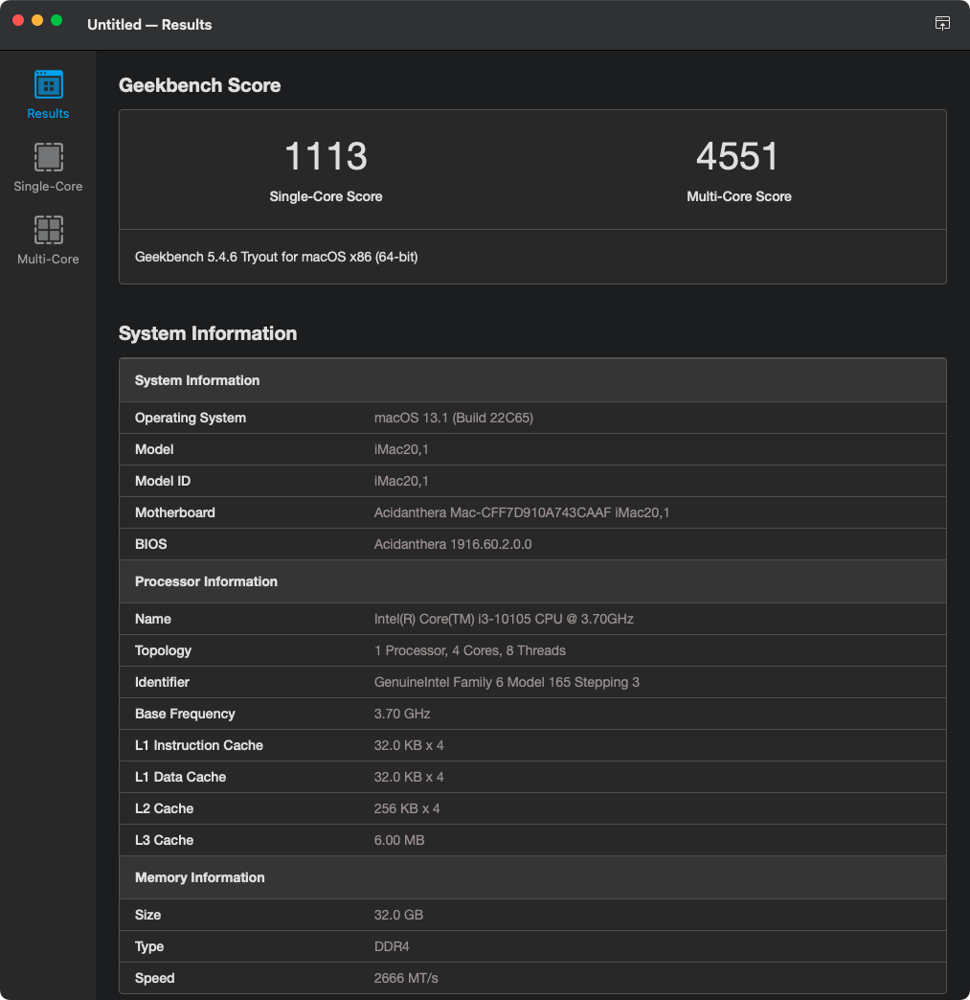

## ThinkCentre-M930q Hackintosh OpenCore EFI


### Supported model

- M70q 
- M80q
- M730Q
- M930q 




### [简体中文](README.zh_CN.md)


### OpenCore

[OpenCore 0.9.9](https://github.com/acidanthera/OpenCorePkg)


### macOS

- Sonoma
- Ventura
- Monterey
- Big Sur
- Catalina (`config.catalina.plist`)

Intel WLAN Notice: 
 - You need to match `AirportItlwm.kext` to your macOS version.
 - The default `AirportItlwm.kext` works on Ventura only.  If you're using another MacOS version, download the correct version of `AirportItlwm.kext` for that OS, and/or keep `AirportItlwm.kext` disabled while updating MacOS versions.    


### Spec

- Chipset: Q470
- CPU: Intel 10th i3-10105
- Memo: Samsung 32GB(2x16GB) DDR4 2666 Mhz
- iGPU: Intel UHD Graphic 630
- HDA: Realtek ALC233
- SSD: WD SN750 512G
- LAN: Intel
- WLAN: BCM94360CS2


### BIOS

```
Devices
  |-- ATA Drive Setup
    |-- Configure STAT as: ACHI
  |-- Video Setup
    |-- Select Active Video: IGD
    |-- Pre-Allocated Memory Size: 64MB
    |-- Total Graphics Memory: Maximum

Advanced
  |-- CPU Setup
    |-- Intel(R) Hyper-Threading Technology: Enabled
    |-- Core Multi-Processing: Enabled
    |-- Intel(R) Virtualization Technology: Enabled

Power
  |-- Automatic Power On
    |-- Wake on LAN: Disabled
    
Security
  |-- Secure Boot
    |-- Secure Boot: Disabled

Startup
  |-- Fast Boot: Disabled
```

### Notes
 - Use [OpenCore Configurator](https://mackie100projects.altervista.org/opencore-configurator/) to build your SMBIOS [serial numbers]
 - You must Use CFGLock.efi Tool to Unlock CFG LOCK first.  To see this menu, press SPACE BAR at the OpenCore pick screen.  You'll "flip the bit" so that the value is "0"; this requires selecting the highlighted icon, then selecting "Y" to flip the bit to 0.
 - Note for Sonoma 14.4: You must change SECUREBOOTMODE to DISABLED in order to successfully install/upgrade to MacOS 14.4.  You can safely leave the mode at DISABLED. 

### Screenshot







### Kexts

- [Lilu.kext 1.6.7](https://github.com/acidanthera/Lilu)
- [SMCProcessor.kext 1.3.2](https://github.com/acidanthera/VirtualSMC)
- [SMCSuperIO.kext 1.3.2](https://github.com/acidanthera/VirtualSMC)
- [VirtualSMC.kext 1.3.2](https://github.com/acidanthera/VirtualSMC)
- [WhateverGreen.kext 1.6.6](https://github.com/acidanthera/WhateverGreen)
- [AppleALC.kext 1.8.9](https://github.com/acidanthera/AppleALC)
- [IntelMausi.kext 1.0.7](https://github.com/acidanthera/IntelMausi)


### Tools

- [Hackintool](https://github.com/headkaze/Hackintool) 
- [OCAuxiliaryTools](https://github.com/ic005k/OCAuxiliaryTools) AKA `OCAT`.
- [OpenCore Configurator](https://mackie100projects.altervista.org/opencore-configurator/) AKA `OCC`.
- [GenSMBIOS](https://github.com/corpnewt/GenSMBIOS) Generate SMBIOS.
- [MountEFI](https://github.com/corpnewt/MountEFI) Mount EFI partition.
- [EFI Agent](https://github.com/headkaze/EFI-Agent) Better EFI partition mount App.
- [gibMacOS](https://github.com/corpnewt/gibMacOS) Build your own MacOS image.
- [ProperTree](https://github.com/corpnewt/ProperTree) Plist editor.


### Contact Us

QQ Group: 23304408


